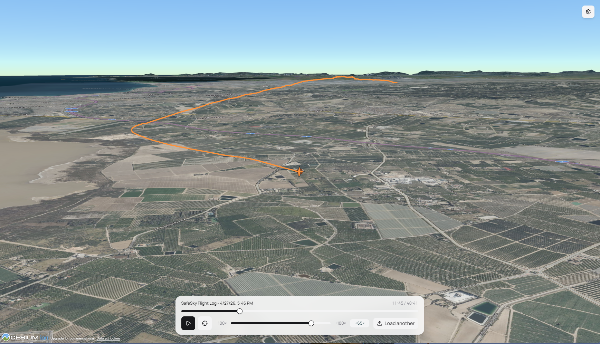
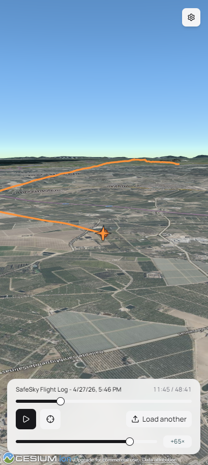

# Flight3DView

Replay GPS tracks as a cinematic 3D flight over a [Cesium](https://cesium.com/) globe, right in your browser.

Drop in a `.gpx`, `.kml`/`.kmz`, `.igc`, or Flightradar24 CSV export and watch the aircraft trace your route across real terrain and imagery — with full play / pause / seek / speed / reverse controls. Export the replay as an **MP4 video** in 720p or 1080p, landscape or portrait, when you want to share it.

<p align="center">
  
</p>

<p align="center">
  
</p>

## What it does

- **Loads GPS tracks** from common formats:
  - GPX (`.gpx`)
  - KML / KMZ (`.kml`, `.kmz`)
  - IGC (`.igc`) — paraglider / glider flight logs
  - Flightradar24 CSV exports (`.csv`)
- **Renders the route in 3D** on a Cesium globe with real terrain and satellite imagery.
- **Animates a moving aircraft** along the track, with a chase camera that follows it.
- **Transport controls**: play / pause, scrubbing slider, speed multiplier from −100× to +100× (negative = reverse), and a recenter button when you've panned the camera away.
- **Camera that turns with the aircraft**: when you manually pick a viewing angle, the camera keeps that same side visible through banks and turns instead of snapping to an absolute compass heading.
- **MP4 export** of the current playback — encoded entirely in your browser via WebCodecs, with no upload or server round-trip. Pick 720p or 1080p in landscape or portrait, 25 or 30 fps. The camera pose in the exported video matches whatever you've set up on screen, and the speed multiplier you're watching at is baked into the video (so 60 minutes of track at 10× becomes a 6-minute clip).
- **Mobile-friendly UI** — controls reflow for narrow screens.

## 100% client-side — your tokens stay on your device

This is a **purely static web app**. There is no backend, no server-side code, no analytics, no telemetry. Everything runs in your browser.

The app needs a free [Cesium ion](https://ion.cesium.com/) access token to fetch terrain and imagery tiles. When you enter it, the token is stored **only in your browser's `localStorage`** and is sent directly from your browser to Cesium's servers — it never passes through any server controlled by this project. You can safely use your own personal token.

To get a token:

1. Sign up for a free account at [cesium.com/ion](https://ion.cesium.com/).
2. Copy a token from the [Access Tokens](https://ion.cesium.com/tokens) page.
3. Paste it into the prompt the first time you open the app.

You can change or clear the token any time via the gear icon in the top-right corner.

## How to use it

1. Open the app (either run it locally — see below — or visit your deployed copy).
2. Paste in your Cesium ion token on first launch.
3. Click the upload button (bottom-right) and pick a track file.
4. Hit **play**. Scrub the timeline, adjust speed, or drag the camera to look around. The crosshair button snaps the camera back to the aircraft.
5. (Optional) Click **Export** to save the replay as an MP4. Pick resolution and frame rate; the encode runs in your browser and the file downloads when it's done. MP4 export needs a recent Chrome/Edge, Safari 16.4+, or Firefox 130+ (browsers with WebCodecs).
6. Load another track at any time with the **Load another** button.

## Run with Docker

Pre-built images are published to GitHub Container Registry.

```bash
docker pull ghcr.io/tioruben/flight3dview:latest
docker run --rm -p 8080:80 ghcr.io/tioruben/flight3dview:latest
```

Then open <http://localhost:8080> in your browser.

The image is a small Caddy server serving the pre-built static SPA on port `80` inside the container — map it to whatever host port you like.

## Run from source

Requires Node.js 20+ and [Yarn](https://yarnpkg.com/).

```bash
yarn install
yarn dev
```

The dev server listens on <http://localhost:3000>.

### Build a static bundle

```bash
yarn build
```

The output in `dist/` is a fully static site (HTML + JS + CSS + assets). Deploy by copying it to any static host — GitHub Pages, Cloudflare Pages, S3 + CloudFront, Netlify, plain Nginx, etc. No server runtime is required.

```bash
yarn preview
```

Serves the production build locally for a final sanity check.

## Development scripts

```bash
yarn dev          # start the dev server
yarn build        # produce the static SPA in dist/
yarn preview      # serve the production build locally
yarn test         # run the unit test suite
yarn lint         # eslint
yarn format       # prettier --write + eslint --fix
yarn check        # prettier --check
```

## Tech stack

- **React 19** + **Tailwind CSS v4** + **shadcn/ui** for the UI
- **Cesium** (via [Resium](https://resium.darwineducation.com/)) for the 3D globe
- **Mediabunny** + **WebCodecs** for in-browser H.264 MP4 video export
- Bundled as a single static SPA — no server, no router, no SSR

## Credits

Built with [Claude](https://claude.com/claude-code) — pair-programmed end to end with Anthropic's Claude.

## License

[MIT](LICENSE)
